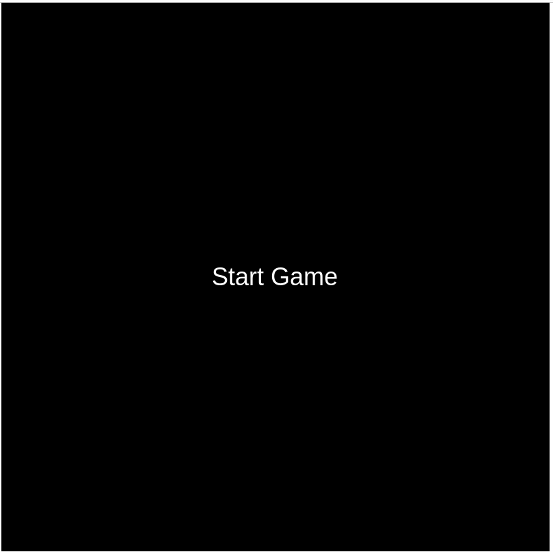
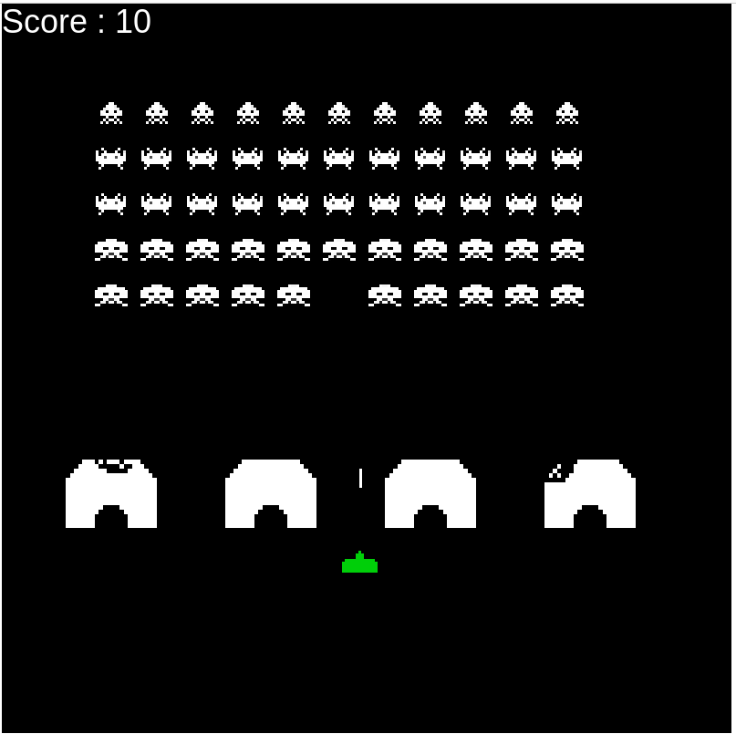

# Projet Space Invaders

## Introduction
Bienvenue dans notre projet Space Invaders ! Ce jeu classique a été recréé avec passion par notre équipe dédiée à l'apprentissage du développement de jeux et à la collaboration en équipe. Ce projet a été réalisé dans le cadre de notre apprentissage pour acquérir de nouvelles compétences, collaborer efficacement et approfondir nos connaissances en développement web.

## Objectif du Projet
L'objectif principal de ce projet était d'apprendre à travailler en équipe sur un projet de développement de jeu. Nous avons cherché à améliorer nos compétences individuelles en programmation, conception de jeux, gestion de projet, et surtout, à renforcer notre capacité à collaborer de manière harmonieuse au sein d'une équipe.

## Fonctionnalités du Jeu
- **Space Invaders Classique :** Nous avons recréé l'expérience de jeu authentique du classique Space Invaders, où le joueur doit détruire les envahisseurs extraterrestres avant qu'ils n'atteignent le bas de l'écran.
- **Contrôles Intuitifs :** Les contrôles ont été simplifiés pour une expérience de jeu fluide. Utilisez les touches directionnelles pour déplacer le vaisseau spatial et la barre d'espace pour tirer sur les envahisseurs.

## Comment Jouer
Version en ligne disponible a l'url: http://spaceinvader.freezinghell.cc

pour commencer a jouer il faut appuyer sur le bouton start game


*menu d'accueil*

Le joueur est le petit vaisseau en vert et il est déplacable de gauche a droite avec les touches directionnelles du clavier.  
Le tir est effectué en appuyant sur la barre espace du clavier.


*tir du joueur*

Le score peut etre enregistrer une fois les trois vie du joueur épuisé. Il s'agit d'un enregistrement locale qui n'est pas mis en ligne.


*tir du joueur*

## Contributions

Nous sommes ouverts aux contributions ! Si vous souhaitez contribuer à l'amélioration du jeu, veuillez suivre ces étapes :

1. Forkez le projet comme suit:
    Clonez ce dépôt sur votre machine locale.
    ```bash
    git clone https://github.com/Kutarumo/pixi
    ```
    Ourvrez le repositoty sur un IDE telle que VSCode.  
    Documentation du code sur: http://spaceinvader.freezinghell.cc/docs  
    Dans un terminal installer les dépendances requises avec:  
        ```
        npm install
        ```
    Puis lancez le projet avec:  
        ```
        npm start
        ```
2. Créez une branche pour votre fonctionnalité. 
    ```
    git checkout -b amelioration-fonctionnalite
    ```
3. Committez vos modifications 
    ```
    git commit -m 'Ajout de votre amélioration
    ```
4. Poussez la branche. 
    ```
    git push origin amelioration-fonctionnalite
    ```
5. Ouvrez une Pull Request.

## Auteur
Kutarumo: MOE  
fr33zingH3ll: Lead-Dev  
YasinAgh: dev  